<div align="center">

<picture>
  <source media="(prefers-color-scheme: dark)" srcset="./dark.svg">
  <source media="(prefers-color-scheme: light)" srcset="./light.svg">
  
</picture>

</div>

<br>

## About

Hi, I'm **Rahul Kumar**, a Software Developer at **Suropriyo Enterprises Pvt Ltd**, based in **Kolkata, India**. I focus on **backend development** and **Java full-stack development**.

## Stack

`Java` · `Spring Boot` · `React` · `CodeIgniter` · `PHP` · `HTML` · `CSS` · `JavaScript` · `MySQL` · `PostgreSQL`

## Featured Projects

| Project | Description |
|---|---|
| [Shopping-Mart](https://github.com/01-Rahul-kr/Shopping-Mart) | Shopping Mart — a web app built with HTML, CSS, JS |
| [Lifeline-Healthcare](https://github.com/01-Rahul-kr/Lifeline-Healthcare) | A hospital web app built with HTML, CSS and JS |
| [Hunger-s-Hurt](https://github.com/01-Rahul-kr/Hunger-s-Hurt) | Hunger's Hurt — an online food ordering website |
| [Student-Management-System](https://github.com/01-Rahul-kr/Student-Management-System) | Student management system (JavaScript) |

## Connect

| | |
|---|---|
| 🐙 GitHub | [github.com/01-Rahul-kr](https://github.com/01-Rahul-kr) |
| 💼 LinkedIn | [linkedin.com/in/01-rahul-kr](https://www.linkedin.com/in/01-rahul-kr/?isSelfProfile=true) |

<br>

## 🐍 Contribution Snake

Animated snake that "eats" your contribution graph, with dark/light mode support and daily auto-update.

**1. Add the workflow** — create `.github/workflows/snake.yml` in your profile repo:

```yaml
name: generate snake

on:
  schedule:
    - cron: "0 */12 * * *"
  workflow_dispatch: {}
  push:
    branches:
      - main

permissions:
  contents: write

jobs:
  generate:
    runs-on: ubuntu-latest
    steps:
      - uses: Platane/snk/svg-only@v3
        with:
          github_user_name: ${{ github.repository_owner }}
          outputs: |
            dist/github-contribution-grid-snake.svg
            dist/github-contribution-grid-snake-dark.svg?palette=github-dark

      - uses: crazy-max/ghaction-github-pages@v4
        with:
          target_branch: output
          build_dir: dist
        env:
          GITHUB_TOKEN: ${{ secrets.GITHUB_TOKEN }}
```

**2. Embed it in your README:**

```html
<picture>
  <source media="(prefers-color-scheme: dark)" srcset="https://raw.githubusercontent.com/01-Rahul-kr/01-Rahul-kr/output/github-contribution-grid-snake-dark.svg">
  <source media="(prefers-color-scheme: light)" srcset="https://raw.githubusercontent.com/01-Rahul-kr/01-Rahul-kr/output/github-contribution-grid-snake.svg">
  
</picture>
```

After the workflow runs once, an `output` branch will hold the generated SVGs.

</div>
